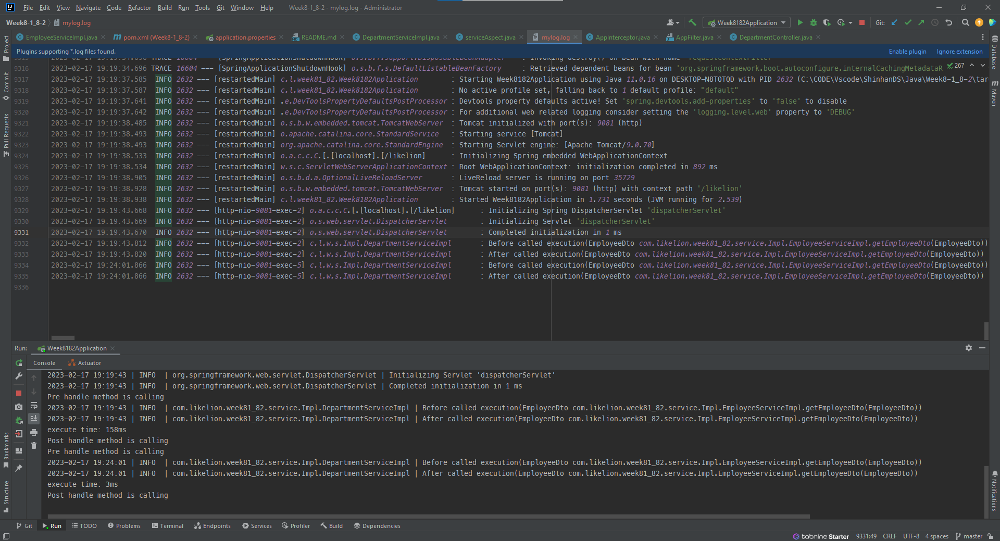

## Practice week 8-1, 8-2
### 1. Validate EmployeeDto and DepartmentDto
* EmployeeDTO

###     

* DepartmentDto

### 2. Logging file 

### 3. Logging with AOP and interceptor

#### 4. Filter postman request

