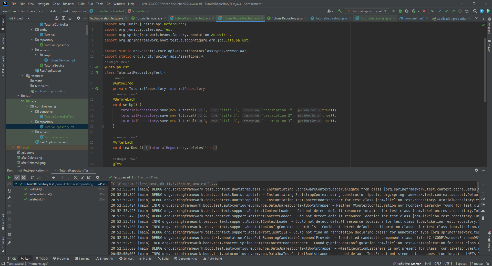
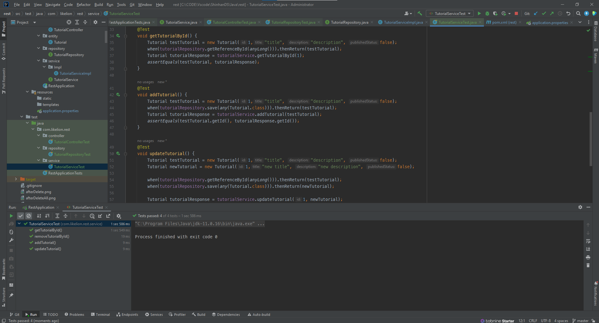
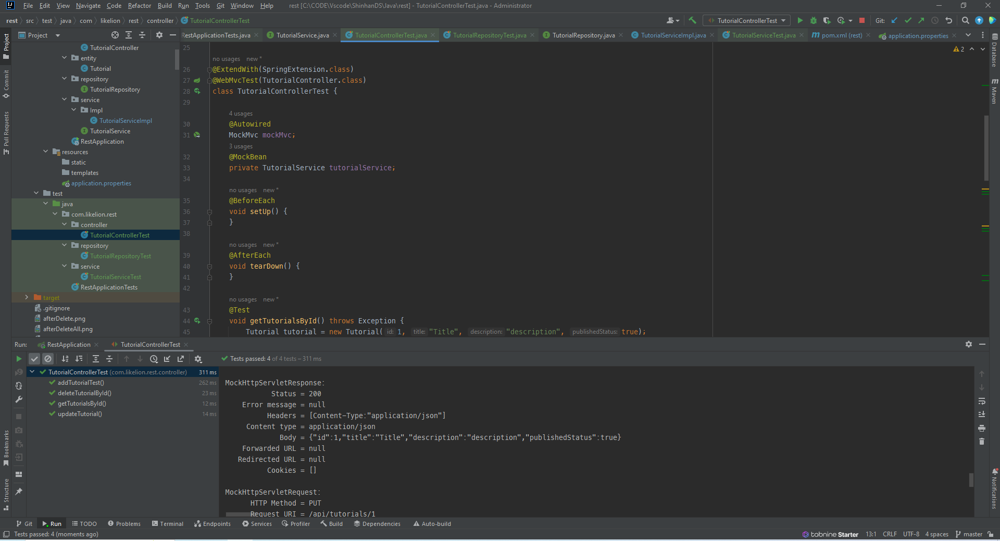
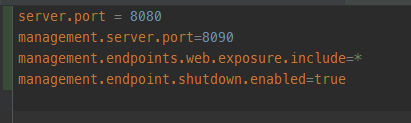
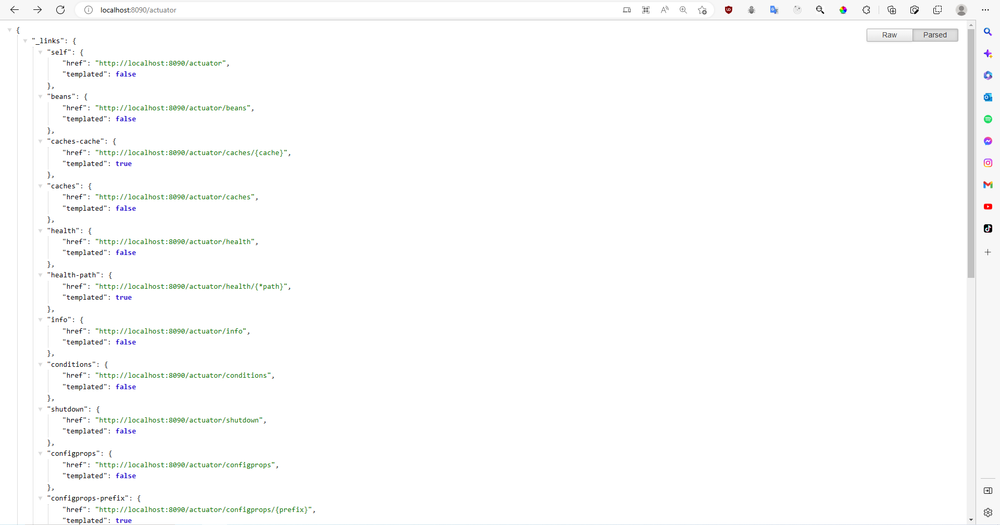
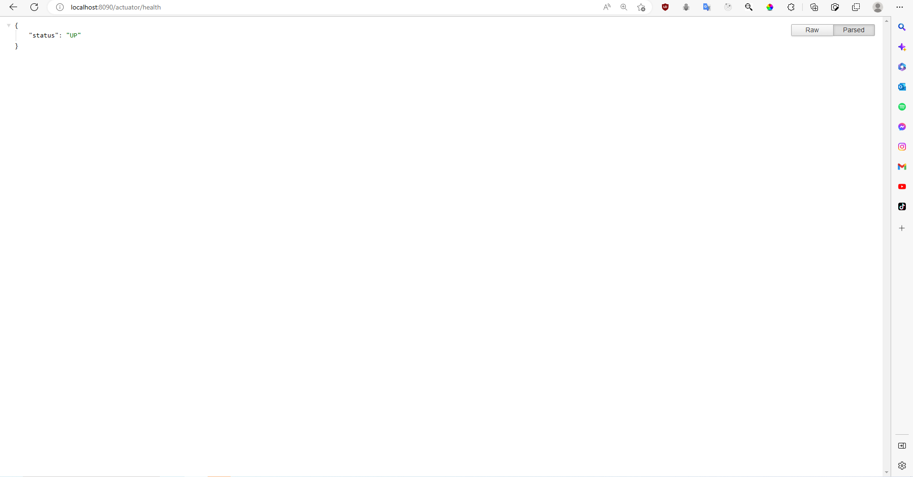
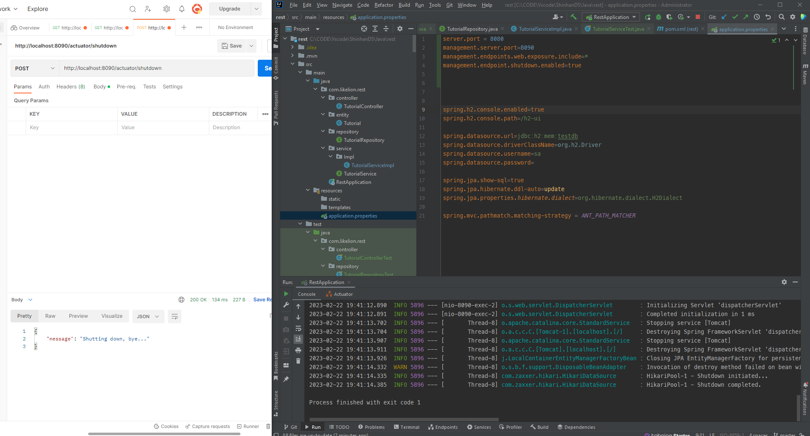
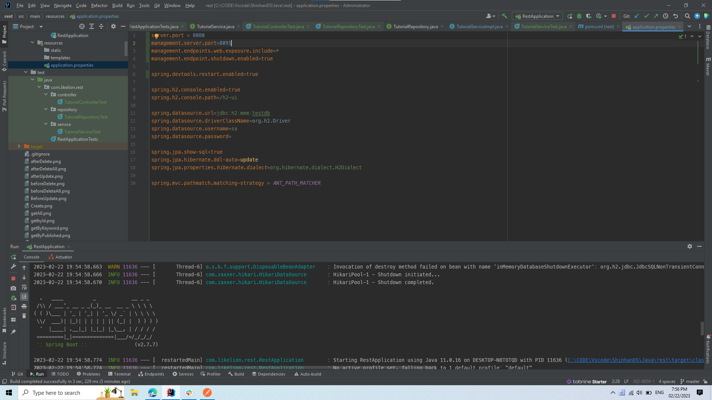

## PRACTICE WEEK 8-3
### 1 - Spring Boot Tests
* Test case for repository layer:
###

###
* Test case for service layer:
###

###
* Test case for controller layer:
###

### 2 - Actuato, Devtools
* Setup Actuator properties:
###

###
* Endpoints list check:
###

###
* Application health check:
###

###
* Shutdown application by actuator:
###

###
* Change management port from 8090 to 8091 use Devtools:
###

###
* Endpoints list check with new port:
###

