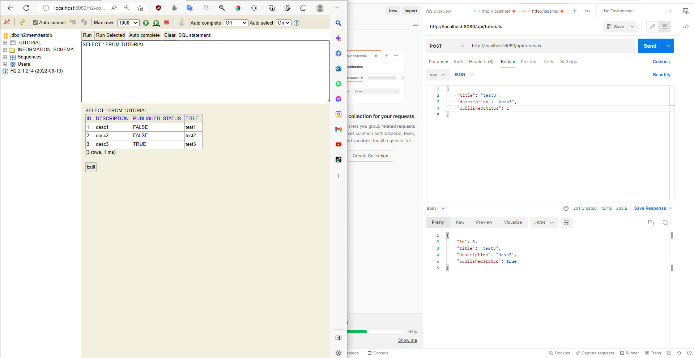
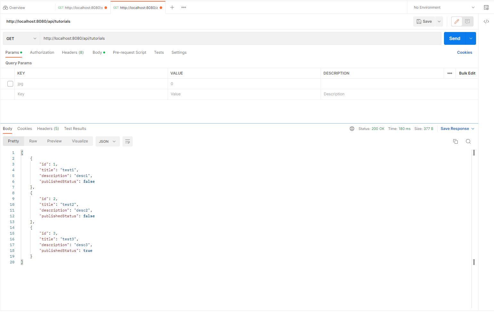
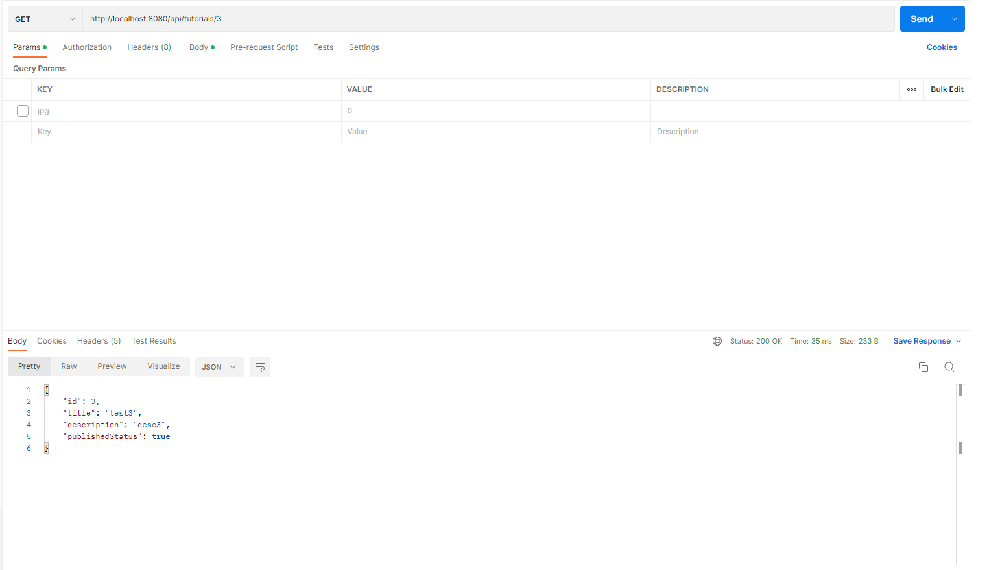
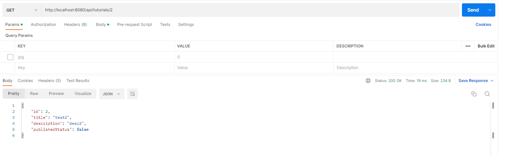
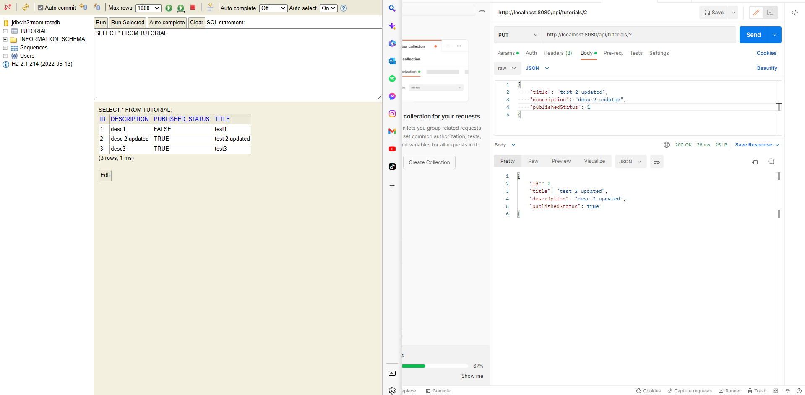
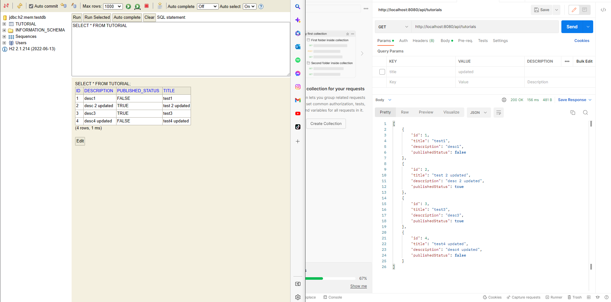
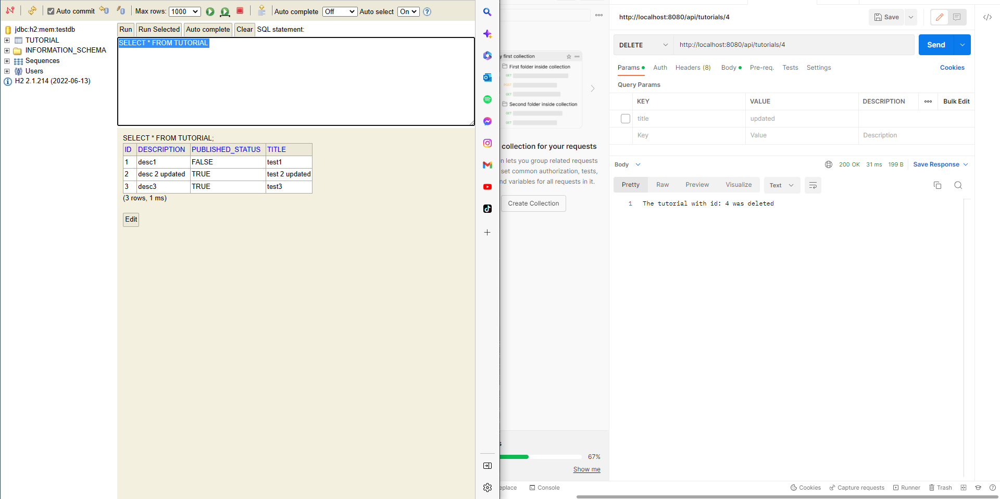
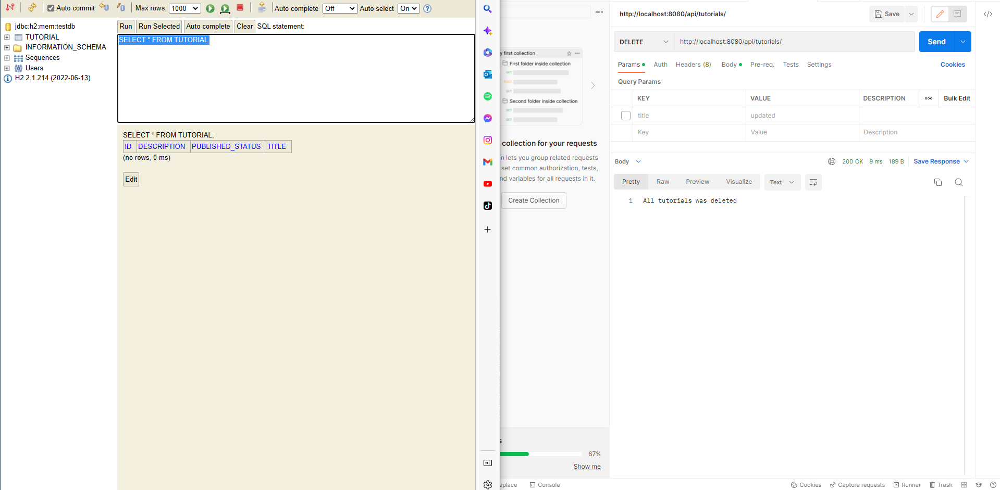
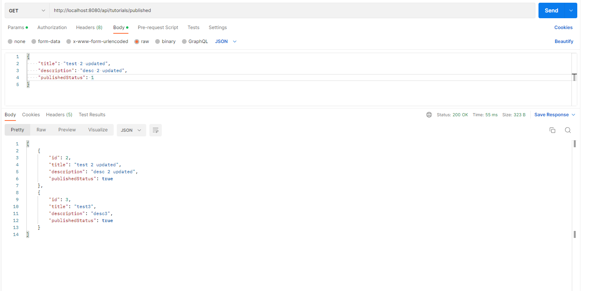
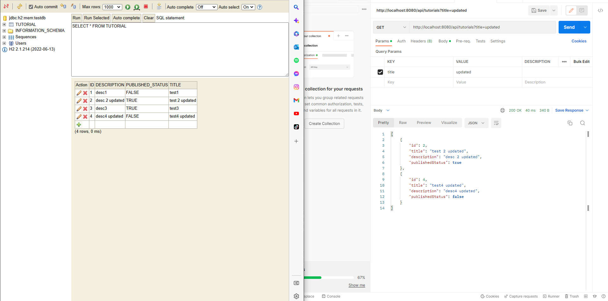

## POST /api/tutorials 
### Create a new tutorial

## GET /api/tutorials
### Get all tutorials

## GET /api/tutorials/{id}
### Get tutorial by given id

## PUT /api/tutorials/{id}
### Update tutorial by given id
* Before update

* After update

## DELETE /api/tutorials/{id}
### Delete tutorial by given id
* Before delete tutorial with id = 4

* After delete tutorial with id = 4

## DELETE /api/tutorials
### Delete all tutorials
* Before delete all tutorials

* After delete all tutorials

## GET /api/tutorials/published
### Get tutorial by given id

## GET /api/tutorials?title=[keywork]
### Get tutorials contains keyword
