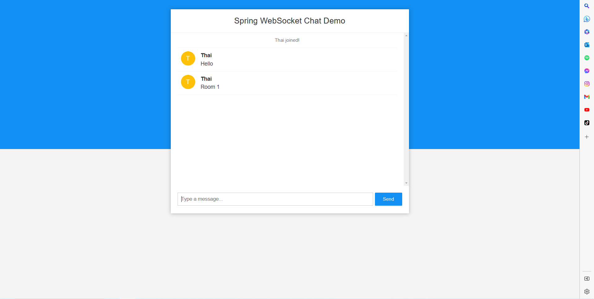

# Practice Websocket, Redis and Kafka

#### Create docker-compose.yml file:
````yml
version: "3"
services:
  zookeeper:
    image: 'bitnami/zookeeper:latest'
    ports:
      - '2181:2181'
    environment:
      - ALLOW_ANONYMOUS_LOGIN=yes
  kafka:
    image: 'bitnami/kafka:latest'
    ports:
      - '9092:9092'
    environment:
      - KAFKA_BROKER_ID=1
      - KAFKA_CFG_LISTENERS=PLAINTEXT://:9092
      - KAFKA_CFG_ADVERTISED_LISTENERS=PLAINTEXT://127.0.0.1:9092
      - KAFKA_CFG_ZOOKEEPER_CONNECT=zookeeper:2181
      - ALLOW_PLAINTEXT_LISTENER=yes
    depends_on:
      - zookeeper

````

#### Open Terminal and run:
`docker-compose up -d`

#### Docker file:

```` Dockerfile
FROM maslick/minimalka:jdk11
VOLUME /tmp
ARG JAR_FILE=target/*.jar
COPY ${JAR_FILE} app.jar
ENTRYPOINT ["java", "-jar", "/app.jar"]
````

#### Terminal
* Build image: `mvn clean install -Dskiptest && docker build -t kafka-redis-websocket .`
  
  
* Run image: `docker run --name kafka-redis-websocket-container -p 8080:8080 kafka-redis-websocket`
  

* List topic in Kafka :
  


## Demo Chat WebApp



## Dynamic Topic Kafka

#### Create new topic


#### Delete old topic

